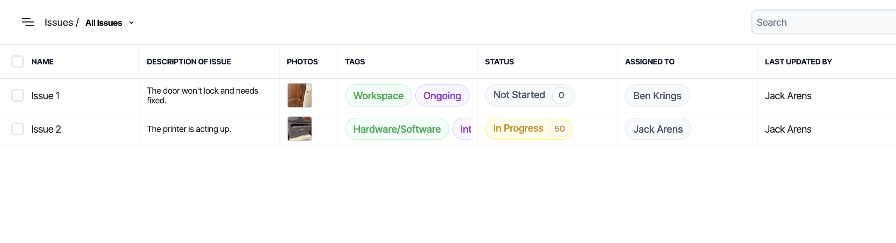
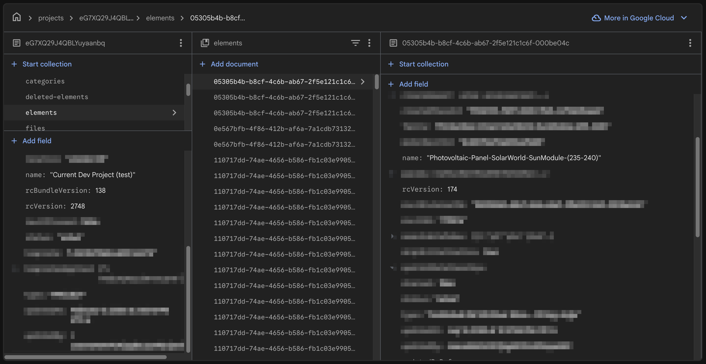
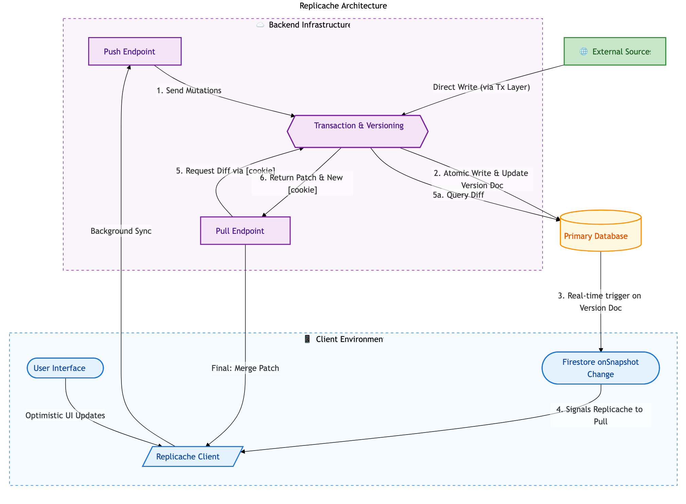

## Why this Article

Our journey to implementing a local first web application at [Layer](https://layer.team) started as a way to resolve issues with having the data we wanted for clients readily accessible, and turned into a long, comprehensive architecture buildout with quite a few obstacles. Along the way, we were inspired by resources put out there on similar journeys at [Linear](https://linear.app/now/scaling-the-linear-sync-engine) and even [blog posts from smaller companies like us](https://marcoapp.io/blog/offline-first-landscape), so I thought the right thing to do was to pay it forward. This article is a write-up of our experience building a local-first architecture for Layer, a construction management platform used in architecture firms and on job sites around the world. I'll cover the context that led us to this decision, the challenges we faced, and the solutions we implemented.

## Introduction

I learned the hard way that "just load it when the user asks" is a trap. People expect the data to be there already. Consider the two categories: `issues` and `users` (think separate tabs in an Excel document). Every issue has one or more assignees, alongside data like a description, cost to resolve, or photos. Every user carries data like home base, specialty, and contact info. When viewing issues in a table, users reasonably expect to see the assignee's basics inline. On the users page, they expect a sense of which kinds of issues that person usually owns, and maybe some high level aggregations, like average cost to resolve or when any issue was last updated. For a small project or domain, this is trivial. At scale, with tens of thousands of issues and hundreds of users, it becomes punishing.

For example, to render the following table of issues where each row represents an individual issue and each column represents pieces of data about that issue, we have to have the full representation of each issue. Because the assigned user is present on the issue data, we can display it without any problems.

_Issues table example_

However, if we want to show any additional information about the users that have been assigned to that issue, we need to have the full set of data for each associated user.

For a long time, our solution at Layer was to limit the data shown in high level views (like tables), loading richer related data only when users clicked through to a specific entry (row). This kept bandwidth in check, but at the cost of users not having all the data they expected, when they expected it. It also meant that we were loading similar or overlapping sets of data repeatedly. As users navigated our app, they might load the same user data multiple times, once per issue they clicked into. This led to a lot of redundant network requests and slower perceived performance.

The trouble showed up when relationships became more complex. To support high level (table) views, we propagated easy fields (names, IDs), but this wasn't feasible for all the data users could possibly want. This also introduced issues with drift: the presence of stale data because a propagation operation had failed. At project scale, neither direction was cheap (or reasonable).

In addition to these concerns about data availability within complex setups, our users wanted some sort of reliable offline experience. In many of these use cases, limitations with loading data from our servers were reasonable(ish), but users couldn't understand why the data they were entering into the app locally couldn't perform as expected. Our Firestore integration provided some offline capabilities, but it was clear that we needed a more robust solution to meet our users' needs.

## Solutions Considered

| Approach          | Offline Support | Complexity |    Data Freshness     | Performance at Scale |
| ----------------- | :-------------: | :--------: | :-------------------: | :------------------: |
| Direct DB Calls   |       ❌        |    Low     |     Always fresh      |         Poor         |
| Propagation       |       ❌        |   Medium   |    Prone to drift     |         Poor         |
| On-Demand Loading |       ❌        |    High    |     Always fresh      |       Variable       |
| Local-first       |       ✅        |   Medium   | Eventually consistent |      Excellent       |

### **Propagation**

As mentioned, propagation was our first approach, and it worked (ish) until users actually wanted to use the data. Every attempt we made to patch over limitations just resulted in jank(ier) code and mounting tech debt. Full scale propagation of all desired data was too expensive and immediately invoked searches for generic diagrams of exponential growth to share with "management".

### **On-Demand Loading**

We considered an "on-demand" loading approach in which we build out an endpoint that would load all the data for the given page in one request. For example, when a user navigates to the issues table, we would make a single request that returns all the issues along with the relevant user data for each issue.

_XKCD 378 - Real Programmers_

This is generally where the "Firestore/NoSQL/backend-less apps aren't for production applications" crowd gets really excited. "If you would've just invested in a REAL database and .NET backend with a traditional ORM like a real company, you wouldn't have this problem!" Unfortunately (for them), this approach still has limitations, especially as the amount of data grows, resulting in complex and likely bug-prone reducers. Most importantly for us, it doesn't allow for offline functionality at all and would still result in much of a user's data being loaded multiple times as they navigate the app. Oldest isn't always best - I'll leave it at that.

:::warning
On-demand loading creates complex reducers that are prone to bugs and offers zero offline capability. For data-heavy applications, this approach doesn't scale.
:::

### **Local-first**

_I just want my data on my computer, not the cloud_

Occam's Razor: What if all the data was just always loaded? No more on demand network requests at all! We generally knew that the majority of our users were working with somewhere around 1,000 to 10,000 entries (issues, users, etc) in a given project, which meant that loading all the data into the client upfront was feasible and wouldn't require any more time or network bandwidth than loading our application itself. For larger projects, a slower initial load time is a reasonable tradeoff for the improved performance and offline capabilities that come with having all the data available locally.

:::tip
For most projects with 1,000-10,000 entries, the entire dataset can be loaded upfront with negligible impact on initial load time.
:::

Obviously, we can't load all the data each time the app loads. We'd need to account for changes to the data on other clients or the server to ensure users don't "lose" or overwrite each other's work. This was pretty clearly the setup to a problem solved by a syncing "engine", in which the client maintains a local copy of the data and synchronizes with the server in the background to stay up to date.

## Why Local-first Became the Answer

A few things had us well positioned to implement a local-first architecture. First, our application is naturally divided into small(er) batches of data (projects), in which users would perform large amounts, if not all of their work for a given session. This meant loading or initialization time was a penalty paid a few times per session, if not just a single time, rather than frequently as users navigated around the app. Second, our users were already accustomed to working in rather heavy and data intensive applications (like Revit), so they were more tolerant of a longer initial load time in exchange for a more responsive and reliable experience once the data was loaded. Being able to provide the full suite of (or at least getting closer to) the types of powerful tools our users had been requesting was considered a reasonable tradeoff for occasional initialization times. Finally, offline functionality was a must-have for our users, and a local-first architecture was the only way to achieve that in a way that met their expectations.

Additional capabilities would also come out of our local-first architecture beyond the initial motivation of data availability and offline functionality. For example, we would be able to implement more powerful filtering and sorting capabilities that could be performed locally without the need for additional network requests. In turn this has led to an opportunity to share filter/sort logic between the front-end and back-end, as we can use the same JavaScript filter engine on both sides to ensure consistency in how data is filtered and sorted regardless of whether the user is online or offline.

### Providers

We explored a handful of providers during our research into local-first architectures, including Firestore's offline capabilities, Replicache, and RxDB. Our primary concerns were speed, reliability, and ease of integration. We ultimately chose Replicache for its maturity and control over the implementation. It was later open-sourced, which gave us confidence in its long-term viability. As mentioned, we had already been using Firestore for our primary data storage, but its offline capabilities were insufficient for our needs, particularly in terms of control over storage duration and scope; in terms of control over storage duration and scope, it had none. RxDB had some promising features and excellent marketing, but much of it was locked behind a rather sketchy paywall and seemed overall less mature.

::github{repo="rocicorp/replicache"}

**Key features of Replicache include:**

- Flexible implementation: Replicache provides a client library that handles the local data storage read/write and synchronization calls, but the push/pull endpoints are defined by the implementers, giving us the flexibility to tailor the behavior to our specific needs. The server library is limited to types and interfaces that ensure compatibility with the client, but otherwise doesn't impose any constraints on how we implement the server-side logic.
- IndexedDB storage: Replicache uses IndexedDB for local storage, which is a widely supported and performant option for storing large amounts of data in the browser. This was important for us given the amount of data we needed to store locally and our need for cross-platform support (web and Capacitor iOS). We also wanted battle-tested storage[^1]. Origin Private File System API implementations were a bit too new for our tastes, and we wanted to avoid the risk of running into issues with browser support or performance.
- Observability: Replicache provides "hooks" that allow us to easily observe changes to the local data and update our UI accordingly. This was important for ensuring a responsive and seamless user experience as data is synchronized in the background.
- Designed for NoSQL: Replicache is designed to work with NoSQL data models, which was a good fit for our existing Firestore data structure. This allowed us to avoid the need for complex transformations or migrations of our data to fit a different model. Replicache's successor, Zero, is designed for more traditional relational data models (SQL), though less offline capable.

[^1]: We actually found out that the storage layer is customizable — Replicache provides an IndexedDB wrapper, but it could be swapped for another key/value storage solution if needed.

## Technical Implementation

The technical implementation of our local-first architecture involved several key components, including the design of our push/pull endpoints, the implementation of a client service that wraps around Replicache, and (later) the development of a filter/sort engine that can be used both on the front-end and back-end.

### Per-Space Versioning

Replicache requires that you pick from one of their versioning strategies to ensure that all changes are properly versioned and that conflicts can be resolved. We chose to implement per-space versioning, which means that each project (or "space") in our application has its own version number that is incremented with each change. This allows us to track changes at the project level and ensures that we can properly synchronize changes across clients without conflicts.

_Database Structure_

:::important
For Layer, this means storing a version number on the project and each element document in Firestore. The overall project version (`rcVersion`) is incremented with each change to the project or any of its elements, while each element document has its own version number (`rcVersion`) that is incremented with each change to that specific element.
:::

Bulk updates to the project (e.g. a change that affects multiple elements) are handled by incrementing the project version and updating the version numbers of all affected elements in a single transaction. This ensures that all changes are properly versioned and that clients can synchronize changes without conflicts.

### Overview

#### High-level Architecture

_High-level Architecture_

1. **Client**: Web/iOS app. All interactions go through the Replicache client service, which provides a simple API for reading/writing data and handles synchronization with the server in the background.
   - Firestore allows for easy watching of data changes, so listening to the primary database for changes and triggering background syncs is straightforward.
2. **Primary Database**: Firestore. Standard NoSQL database that serves as the source of truth for all data.
   :::caution
   **Nothing** gets written to Firestore without going through the transaction and versioning system. This is critical for maintaining data integrity across all clients.
   :::
3. **Push Endpoint**: Receives updates from the client and applies them to the primary database. This is where we handle conflict resolution and ensure that all changes are properly versioned. Also performs authentication checks. Along with `pull`, this is called by the client in the background.
4. **Pull Endpoint**: Provides the client with the latest data from the primary database. This is where we handle any necessary transformations or filtering of the data before it is sent to the client. Fresh clients need a full dump of the data, while clients that have been offline for a while or are currently online can receive a more incremental update. Along with `push`, this is called by the client in the background.
5. **External Sources**: Other data manipulation sources (Cloud Functions, API endpoints, etc) that can also write to the primary database. These changes will be picked up by the pull endpoint and synchronized to the clients in the background.

## Challenges

It didn't take long to run into a few challenges with our implementation. In general, things worked as expected, but once projects got larger, we started to see some performance issues with the initial load time as well as some edge cases with our synchronization logic. The following are a few of our bigger challenges and how we addressed them.

### **Bootstrapping Large Clients**

It didn't take testing very long to see that our very largest projects (~0.27% of our projects contained over 40,000 elements) were taking a very long time to load initially. This represented somewhere around 100 MB of data on average. To keep from running into data limits or streaming issues with a single call, the `pull` endpoint was configured by default to page data in batch of 1,000 documents (later increased to 10,000), which meant that clients were waiting for multiple round trips to get all the data they needed.

Two things stood out as we began to diagnose this issue and look for solutions. First, the `pull` endpoint was spending quite a bit of time serializing the data to send to the client, which was adding to the overall load time. Second, and more critically, we realized that the client would always call `pull` one final time after the initial batch(es) of `pull` to confirm that the version of data it had received in the inital pages was up to date. This last "extraneous" call to `pull` was an indicator that the actual version of the initial batch(es) of data being up to date was not critical. This meant that we could potentially send a slightly stale version of the data in the initial batch(es) to speed up the load time, as long as we ensured that the final call to `pull` would provide the latest data.

:::tip[Key Insight]
The power behind a sync engine is the ability to operate asynchronously. You can send somewhat stale data initially and rely on the final pull to catch up.
:::

This led us to a solution: we could pre-serialize the data for each project and store it in a cache. Then when a client requests data for a project, we can send the pre-serialized data to the client right away. We can then rely on the final call to `pull` to ensure that the client gets up to date. This was inspired in part by Firestore's [bundle builder](https://firebase.google.com/docs/extensions/official/firestore-bundle-builder) extension, which helps reduce database querying costs for apps with millions of users that are constantly loading the same sets of data.

By building a "bundle" for each project that contained the pre-serialized data for a given version and storing it in a storage bucket, we could have the client fetch the zipped bundle file directly from the storage bucket for the initial load. Sure, it was likely to end up out of date fairly quickly, but it was helpful in ensuring that a quick bootstrap could be completed with 70% - 90% of the data that was needed, with a quick background sync to grab the very latest changes.

### **Searching/Sorting/Filtering Read-in Time**

In order to support custom relationships between Layer categories (e.g. issues, users, etc) - think tabs in Excel - we had built out a very thorough and rather complex set of filtering capabilities in JS that could be used on the front-end and backend to filter groups of elements.[^2] This filter structure was extensible, already had migrations from our old filtering structure, and was built to provide feature parity (and more!) compared to our existing filtering capabilities with ElasticSearch. However, it was built with the assumption that the data would be loaded and available synchronously, which meant that we were running into performance issues when trying to load all that data we had so nicely cached and stored in the user's IndexedDB into memory. Filtering and searching ended up being easier to solve, after all, you can always filter on smaller subsets of data and return those to the user once you have "enough", but sorting was a bit more of a challenge. To filter **and** sort, you need to have all the data loaded and available in memory.

[^2]: I hope to complete an article similar to this one on our filter engine. Stay tuned!

After a bit of research, we came across LokiDB, an in-memory JavaScript database that provides indexing and querying capabilities. By loading index data into LokiDB, we were able to take advantage of its in-memory indexing capabilities to quickly filter and sort the data as needed, even with larger datasets.

::github{repo="LokiJS-Forge/LokiDB"}

We didn't need to use LokiDB for all of our data, just the data that was relevant for filtering and sorting. The data in Replicache (IndexDB) was everything, guaranteed to be up to date with the current sync and complete - no missing attributes. That data was pared down as much as possible to just the attributes we needed for filtering and sorting, and then loaded into LokiDB for quick querying. "Watching" Replicache for changes to entries within certain categories (e.g. issues, users) allowed us to know when to re-query for a given filter configuration, providing a "live-updating" feel to our data.

### **Simultaneous Bulk Server Updates**

:::note[Coming Soon]
This section will detail our approach to handling simultaneous bulk updates from multiple clients and external sources.
:::
